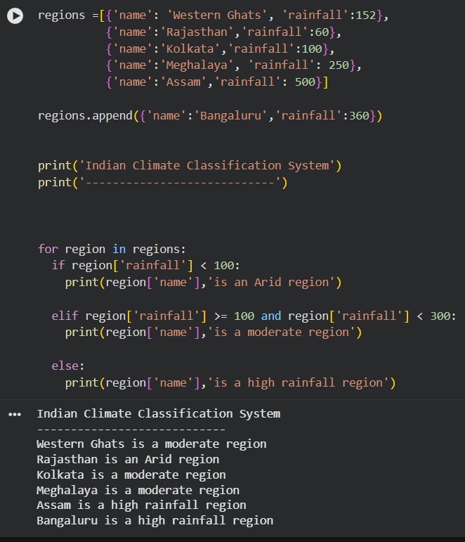

# indian-climate-classification-system
A beginner GIS-Python project that classifies Indian regions based on rainfall using dictionaries, loops, and conditional statements.
# Indian Climate Classification System

## Project Overview

This project classifies regions based on rainfall values using Python.

## Concepts Used

- Lists
- Dictionaries
- Loops
- Conditional Statements
- append()

## Classification Rules

- Below 100 mm → Arid Region
- 100–300 mm → Moderate Rainfall Region
- Above 300 mm → High Rainfall Region

## Sample Output

Rajasthan is an Arid Region
Western Ghats is a Moderate Region
Bangaluru is a High Rainfall Region

## Program Output

Screenshot of the rainfall classification results generated by the Indian Climate Classification System.

## Author

Nazarat Mujtaba
